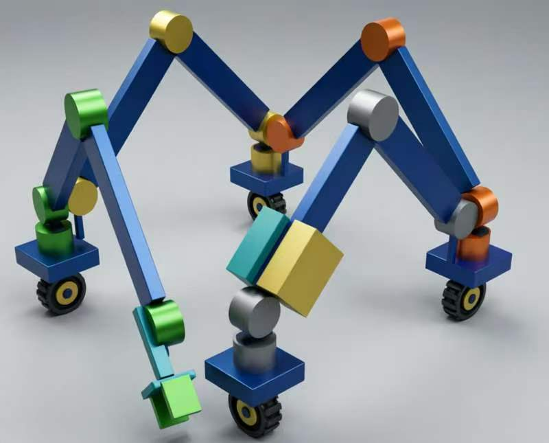
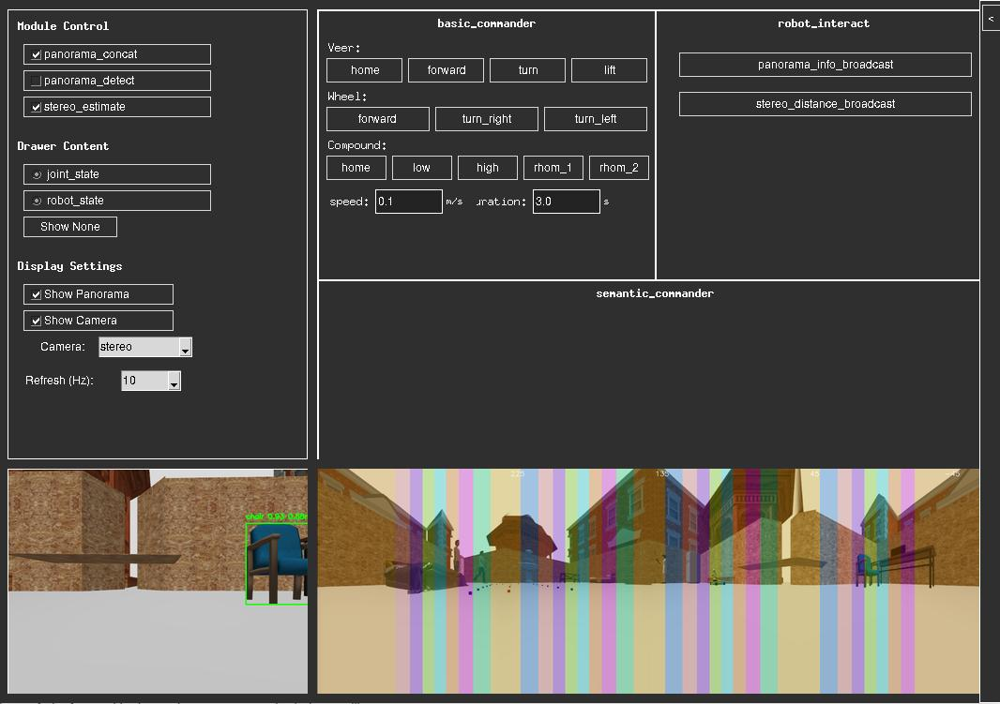

# Four Arm Robot 项目文档

四臂机器人（four_arm_robot）是一个组合式的跨地形机器人项目：四个四自由度机械臂串联，通过控制关节电机变形实现跨地形运动，末端分支操控物体；每个机械臂底座采用舵轮控制平面运动，搭载 6 相机（4 路全景拼接 + 2 路双目测距）。

技术栈：C++ / Python 混合编程、ROS 2 Jazzy、Gazebo 仿真、传统图像处理、3D 视觉、目标检测/分割/追踪、ONNX/TRT/RKNN/NCNN 模型转换部署。

## 效果图

## 控制面板

## 开发记录与规划

# 计划第一阶段（模拟）
- [x] 1.开发环境搭建
- [x] 2.项目框架搭建
- [x] 3.写urdf模型
- [x] 4.gazebo场景搭建
- [x] 5.urdf中增加gazebo配置
- [x] 6.相机配置
- [x] 7.打通流程，写launch文件，跑起来
- [x] 8.ros2moveit生成controler与问题修复
- [x] 9.舵轮底盘运动开发测试
- [x] 10.机械臂组变形开发测试
- [x] 11.4相机全景拼接
- [x] 12.yolo11s det和seg转onnx
- [x] 13.onnx模型推理前后处理实现
- [x] 14.全景画面目标检测
- [x] 15.场景适配 finetune or distillation
- [x] 16.转trt，cuda前后处理与推理
- [x] 17.全景图目标方位估计
- [x] 18.接入双目相机检测
- [x] 19.像素坐标，图像坐标，相机坐标，里程计坐标，世界坐标的转换
- [x] 20.基于检测结果做距离估计（估计基于分割做才够准确）
- [ ] 21.tiny-whisper-v2集成
- [ ] 22.qwen3-0.5B集成
- [x] 23.MOSS-TTS-Nano集成
- [ ] 24.语音识别+大语言模型+语音合成联调
- [ ] 25.拿qwen3 0.5B做自己语料的peft（没条件做模型退化评估）
- [x] 26.一些事件响应开发测试
- [x] 27.tkinter做简易控制面板
- [ ] 28.建图
- [ ] 29.slam可能先用nav2跑通
- [ ] 30.4臂控制
- [ ] 31.34臂控制
