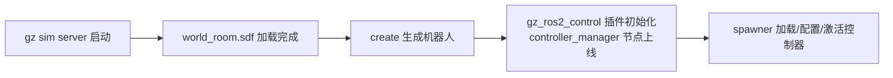

# 仿真启动流程说明（my_robot_gazebo.launch.xml）

> 本文档描述四臂机器人 Gazebo 仿真的启动入口与完整启动流程。
> 当前入口：[`my_robot_gazebo.launch.xml`](src/my_robot_bringup/launch/my_robot_gazebo.launch.xml)（`<timer period="15.5">` 固定延时 spawn 控制器）
> 旧入口：`my_robot_gazebo.launch.py`（事件驱动版，已弃用，仅存档参考）

## 当前完全启动后的rqtgraph


## 1. 启动入口

```bash
ros2 launch my_robot_bringup my_robot_gazebo.launch.xml
```

可选参数：`log_level:=debug`（控制 panorama / stereo 等 verbose 节点的日志级别，默认 `warn`）。

## 2. 启动内容总览

单个 launch 文件拉起整套系统：

| 模块 | 节点 / 动作 | 作用 |
| --- | --- | --- |
| 机器人描述 | `robot_state_publisher` | 发布 `/robot_description`（xacro 即时展开）与 TF |
| 仿真内核 | `gz_sim.launch.py`（ros_gz_sim） | 启动 gz sim server，加载 `worlds/world_room.sdf -r` |
| 机器人生成 | `ros_gz_sim create` | 从 `/robot_description` 话题读取 URDF 并生成到世界 |
| ros2_control | 9 个 `controller_manager spawner`（15.5 s timer 触发） | 加载 / 配置 / 激活全部控制器 |
| 桥接 | `parameter_bridge` | 按 `config/gazebo_bridge.yaml` 桥接话题 |
| 可视化 | `rviz2` | 加载 `urdf_config.rviz`（use_sim_time） |
| 运动规划 | `move_group_gazebo.launch.py`（robot_moveit_config） | MoveIt move_group（use_sim_time） |
| 状态管理 | `robot_state_manager/state_manager` | 提供 `/group_state_manager` 服务（组状态 get_all/get_group/set_group） |
| 全景 | `panorama_camera/display_four_camera` | 四相机拼接全景显示（启动时预加载 TensorRT 检测引擎，`panorama_detect` 开启时无加载延迟） |
| 双目 | `camera_info_corrector` ×2 | 修正 Gazebo camera_info 的 Tx（右相机 = -fx·baseline） |
| 双目 | `stereo_image_proc/disparity_node` | 计算视差图 `/disparity` |
| 双目 | `stereo_camera/stereo_camera_processor` | TensorRT 目标检测 + 立体测距 + 显示 |
| 控制面板 | `robot_panel/robot_panel` | 状态显示与控制面板（tkinter 无边框窗口，Alt+F4 关闭） |

## 3. 核心依赖链（controller_manager 在 Gazebo 内部）



关键点：controller_manager **不是独立节点**，而是由 URDF 中
`gz_ros2_control::GazeboSimROS2ControlPlugin` 托管在 **gz server 进程内部**
（`my_robot.ros2_control.xacro` + `<parameters>$(find my_robot_bringup)/config/ros2_controllers.yaml</parameters>`）。
因此控制器只能在该链全部完成后才能成功拉起。

## 4. 启动时序（固定延时触发控制器）

```
t=0          robot_state_publisher / state_manager / bridge / rviz / move_group / 感知节点 / 控制面板 并行启动
             gz sim server 启动，开始加载 world_room.sdf
             create 阻塞等待 /world/world_room/create 服务就绪
t≈世界加载完  create 生成机器人（URDF → SDF），生成成功后进程退出
             gz_ros2_control 插件初始化，controller_manager 上线
t=15.5s      <timer> 触发 → 9 个 spawner 启动，逐个 load → configure → activate
```

两点说明：

1. **create 自身阻塞**等待世界 create 服务，机器人生成时机由世界加载进度决定（与入口版本无关）；
2. **spawner 由 `<timer period="15.5">` 固定延时触发**，15.5 s 是“世界加载 + 机器人生成 +
   gz_ros2_control 插件初始化”的经验上界；若届时 controller_manager 尚未就绪，spawner 会阻塞
   等待其服务上线（Jazzy 默认 `--controller-manager-timeout 0` 为无限等待）。

## 5. 控制器清单（spawn 顺序即依赖顺序）

| 控制器 | spawn 参数 | 说明 |
| --- | --- | --- |
| `joint_state_broadcaster` | 激活 | 关节状态广播，必须先于其他控制器 |
| `veer_controller` | 激活 | 转向关节轨迹控制器 |
| `wheel_controller` | 激活 | 轮速控制器 |
| `arm_1..4_controller` | `--inactive` | 四臂轨迹控制器，仅加载不激活（避免命令接口争用） |
| `gripper_controller` | 激活 | 夹爪轨迹控制器 |
| `all_arms_controller` | 激活 | 四臂联合轨迹控制器 |

配置文件：`config/ros2_controllers.yaml`（控制器类型声明 + 各自参数）。

## 6. 关键配置文件

| 文件 | 用途 |
| --- | --- |
| `my_robot_description/urdf/four_arm_robot.xml.xacro` | 整机 URDF（含 ros2_control 与 gz 插件） |
| `my_robot_bringup/config/ros2_controllers.yaml` | 控制器清单与参数 |
| `my_robot_bringup/config/gazebo_bridge.yaml` | gz ↔ ROS 话题桥接 |
| `my_robot_bringup/config/left_camera.yaml` / `right_camera.yaml` | 双目标定（camera_info 修正用） |
| `my_robot_bringup/worlds/world_room.sdf` | 仿真世界 |
| `robot_moveit_config/config/my_robot.srdf` 等 | MoveIt 规划配置 |

## 7. 启动验证

```bash
# 控制器是否全部就绪（期望 9 个，arm_* 为 inactive）
ros2 control list_controllers

# 关键服务/节点是否存在
ros2 service list | grep controller_manager
ros2 service list | grep group_state_manager
ros2 node list | grep -E "robot_state_publisher|move_group|spawner"

# 机器人是否生成
ros2 topic echo /clock --once   # use_sim_time 生效

# 控制面板无边框窗口应已随 launch 弹出（Alt+F4 可关闭）
```

## 8. 故障排查

| 现象 | 可能原因 | 检查方式 |
| --- | --- | --- |
| spawner 长时间阻塞等待 controller_manager 服务 | 机器人未生成 / gz_ros2_control 插件未初始化（15.5 s 内未就绪） | 看 gz server 日志中 gz_ros2_control 报错；`ros2 service list` 是否有 controller_manager 服务 |
| `create` 失败退出 | 世界加载过慢，create 等待超时 | 单独重跑 `ros2 launch` 并观察 create 输出 |
| 控制器加载报接口冲突 | arm 控制器未用 `--inactive` | 用 `--inactive` 加载 arm_*，再显式激活 |
| 全部节点正常但无 /disparity | camera_info 修正链路异常 | 检查 corrector 的 input/output 话题是否在桥接配置中 |

## 9. 旧入口：my_robot_gazebo.launch.py（已弃用）

- py 版为事件驱动（create 自身阻塞 + OnProcessExit(create) 触发 spawner + `-t 120` 超时上界），无固定延时。
- 目前以 XML 版（15.5 s 固定延时）为准，py 版不再维护，仅存档参考；本文档所有描述均以 XML 版为准。
