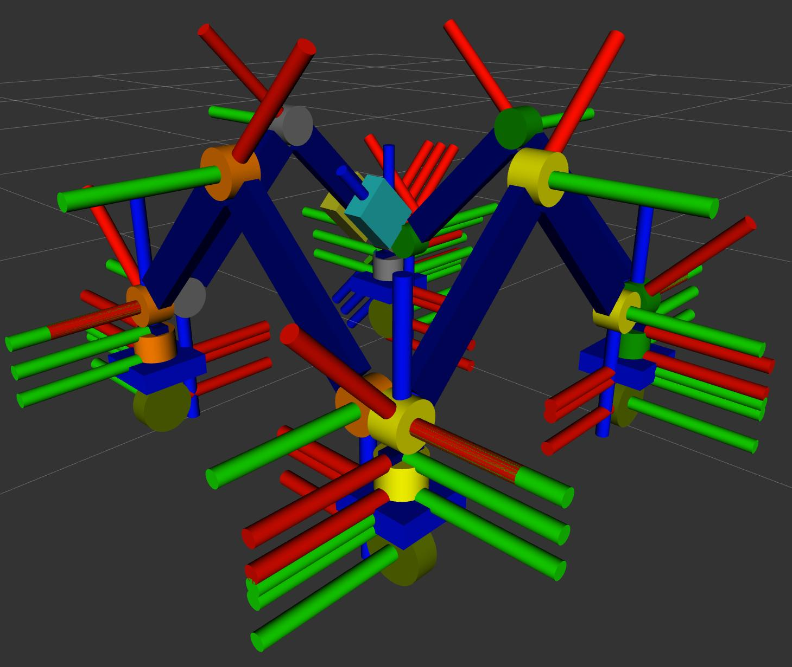

# 机器人结构说明

本文档基于 URDF 模型文件 [four_arm_robot.xml.xacro](../src/my_robot_description/urdf/four_arm_robot.xml.xacro) 介绍四臂机器人（`my_robot`）的机械结构、运动学链路（link/joint 层级）以及传感器布局。



## 1. 总体概述

该机器人是一个**四臂串联式移动操作平台**：四条完全相同的机械臂沿竖直方向自下而上依次级联（臂 1 → 臂 2 → 臂 3 → 臂 4），每条臂的根部都安装有一套**独立的旋转底座（veer）与驱动轮（wheel）**，即整机共有 4 组转向底盘，可在展开后各自独立运动。最顶层的臂 4 末端额外挂载了一个**分支小臂（branch arm）**，其末端带有两指平行夹爪和一对双目相机；每条臂的根部还各安装一个广角相机，四路相机朝外布置用于全景拼接。

整机关节自由度构成：

| 类别 | 关节 | 数量 | 类型 |
| --- | --- | --- | --- |
| 底座转向 | `arm_veer_joint_1~4` | 4 | revolute（绕 Z 轴） |
| 驱动轮 | `wheel_joint_1~4` | 4 | continuous |
| 单臂关节 | `arm_joint_1/3/5/7_*` | 4 × 4 = 16 | revolute |
| 夹爪 | `gripper_left_finger_joint`（右指 mimic 跟随） | 1 + 1 | prismatic |

> 每条臂在 URDF 中编号为 1~8 的关节里，奇数号（1/3/5/7）为可驱动的旋转关节，偶数号（2/4/6/8）为固定连接件。

## 2. xacro 文件组织

| 文件 | 内容 |
| --- | --- |
| `far_common_properties.xml.xacro` | 全局属性（各部件尺寸参数）、材质颜色定义、box/cylinder/球体惯量宏 |
| `main_arm_units.xml.xacro` | 主臂连杆（`arm_base_link`、`arm_part_1~8`）与关节宏、电池/控制器附件 |
| `mobile_base_part.xml.xacro` | 转向底座 `veer_link` 与驱动轮 `wheel_link` 及其关节 |
| `branch_arm_unit.xml.xacro` | 分支小臂、连接件与两指夹爪 |
| `unit_camera.xml.xacro` | 单目广角相机单元（含 Gazebo 传感器） |
| `stereo_camera.xml.xacro` | 分支小臂上的双目相机（camera 5/6） |
| `my_robot.ros2_control.xacro` | ros2_control 硬件接口声明（GazeboSimSystem） |

## 3. 根坐标系与底盘

```
odom
 └─ base_footprint                （虚拟根连杆，里程计发布）
     └─ arm_base_link_1           （base_joint, fixed）
```

- `base_footprint` 为整机根坐标系，Gazebo 中由 `OdometryPublisher` 插件发布 `odom → base_footprint` 的 TF。
- `base_joint` 将 `base_footprint` 抬升至离地高度 `wheel_radius*2 + veer_height + arm_base_height/2`，即底盘高度由轮径、转向座高度与臂基座高度共同决定。

### 3.1 转向底座与车轮

每条臂的基座下方通过 `arm_veer_joint_${prefix}`（revolute，绕 Z 轴，范围 ±π）连接一个转向座 `veer_link_${prefix}`，转向座下方再通过 `wheel_joint_${prefix}`（continuous，绕 Y 轴）连接驱动轮 `wheel_link_${prefix}`：

```
arm_base_link_i ──arm_veer_joint_i── veer_link_i ──wheel_joint_i── wheel_link_i
```

四轮独立转向 + 独立驱动，使机器人在多臂展开后可以像多辆小车一样各自移动。

## 4. 主臂结构

### 4.1 单臂运动链

每条臂（`prefix = 1~4`）由基座到末端依次为：

```
arm_base_link
 └─ arm_joint_1 (revolute, Z)      → arm_part_1  （关节电机外壳，竖直圆柱）
     └─ arm_joint_2 (fixed)        → arm_part_2  （短连杆，竖直向上）
         └─ arm_joint_3 (revolute, Y) → arm_part_3  （关节电机，水平轴）
             └─ arm_joint_4 (fixed) → arm_part_4  （大臂杆，高 0.25 m）
                 └─ arm_joint_5 (revolute, Y) → arm_part_5  （关节电机）
                     └─ arm_joint_6 (fixed) → arm_part_6  （小臂杆，高 0.25 m）
                         └─ arm_joint_7 (revolute, Y) → arm_part_7  （腕部关节电机）
                             └─ arm_joint_8 (fixed) → arm_part_8  （末端延伸杆）
```

要点：

- **关节 1** 绕 Z 轴旋转，实现整条臂的水平回转；初始安装带 90° 偏置（`rpy` 中含 `pi/2`）。
- **关节 3 / 5 / 7** 均为绕各自坐标系 Y 轴的俯仰关节，关节间带 -45° / -90° / -45° 的固定安装偏置，三者轴线相互平行，构成**平面平行四边形式构型**：三条连杆（arm_part_2/4/6）在运动中始终保持竖直，末端姿态稳定。
- 关节限位：关节 1 为 ±3.14 rad，关节 3/5/7 为 ±2.35 rad，均带摩擦与阻尼参数。
- 臂上附件：`battery_link_1`（电池）与 `controller_link_1`（控制器盒）以 fixed 关节对称挂在臂 1 的大臂杆 `arm_part_4_1` 两侧。

### 4.2 四臂级联

臂 2/3/4 的基座通过 `group_joint_${prefix}`（fixed）安装在前一条臂的末端关节件 `arm_part_7_${prefix-1}` 上方，并翻转 180°（`rpy` 含 `pi`）：

```
arm_part_7_1 ──group_joint_2── arm_base_link_2 ── arm 2 链
arm_part_7_2 ──group_joint_3── arm_base_link_3 ── arm 3 链
arm_part_7_3 ──group_joint_4── arm_base_link_4 ── arm 4 链
```

因此四条臂自下而上叠成一列；每条臂的 veer/轮组都挂在自己的 `arm_base_link` 下方，展开后各臂均落地并可独立行走。

## 5. 分支小臂与夹爪

臂 4 的小臂杆 `arm_part_6_4` 上通过 `branch_joint_4`（fixed）挂载分支小臂：

```
arm_part_6_4
 └─ branch_joint_4 (fixed) → branch_arm_link_4       （竖直小臂，高 0.1 m）
     └─ branch_connect_joint_4 (fixed) → branch_connecter_4  （末端连接板）
         ├─ gripper_left_finger_joint  (prismatic, X) → gripper_left_finger_link
         └─ gripper_right_finger_joint (prismatic, X, mimic ×-1) → gripper_right_finger_link
```

- 夹爪为两指平行夹爪：左指行程 0 ~ 0.06 m，右指通过 `<mimic>` 以 -1 倍系数镜像跟随，只需驱动一个关节。

## 6. 相机布局

### 6.1 四路全景相机（camera 1~4）

每条臂的基座 `arm_base_link_${prefix}` 角上都安装一个相机 `camera_link_${prefix}`：

- 安装位置：基座顶面的同一角（`-x, +y` 角），各相机统一绕 Z 轴旋转 135°（`3π/4`）朝外；四臂级联时相邻臂偏转/翻转，使四个镜头分别朝向四个不同方向，形成**环视全景**布局。
- 每个相机附带 `camera_optical_link_${prefix}`（光学坐标系，`rpy = -π/2 0 -π/2` 转换）。
- Gazebo 仿真参数：水平视场角 120°（2.0944 rad），640×480，5 Hz，话题 `camera_${i}/image_raw`。

### 6.2 双目相机（camera 5/6）

`branch_arm_link_4` 上对称安装两个前视相机，构成双目测距单元：

- 左右各偏移 `±2×branch_arm_link_width`，姿态 `rpy = π, -π/4, 0`；各自带光学系 `camera_link_optical_5/6`。
- Gazebo 参数：水平视场角 80°（1.396 rad），640×480，5 Hz，话题 `camera_5/image_raw`、`camera_6/image_raw`。

## 7. ros2_control 与控制接口

`my_robot.ros2_control.xacro` 声明了 `gz_ros2_control/GazeboSimSystem` 硬件插件，所有受控关节均暴露 **position + velocity** 命令接口及 position/velocity 状态接口，共 25 个：

- `arm_veer_joint_1~4`、`wheel_joint_1~4`
- 每臂 `arm_joint_1/3/5/7_${prefix}`（共 16 个）
- `gripper_left_finger_joint`（右指 mimic，不单独受控）

Gazebo 侧通过 `gz_ros2_control::GazeboSimROS2ControlPlugin` 加载 `my_robot_bringup/config/ros2_controllers.yaml` 中的控制器配置。
