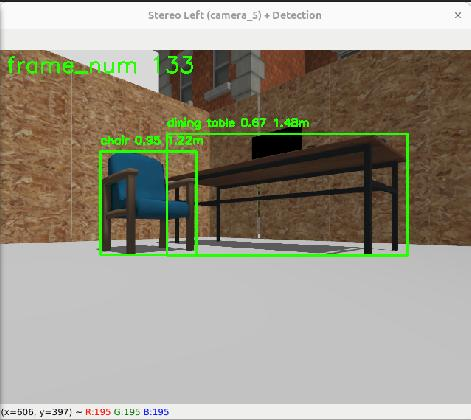

# 双目测距

## 1. 相机信息

### URDF 定义（`stereo_camera.xml.xacro`）

两个相机安装在 `branch_arm_link_4` 上，沿 Y 轴对称放置：

| 参数 | camera_5（左） | camera_6（右） |
|---|---|---|
| 父连杆 | `branch_arm_link_4` | `branch_arm_link_4` |
| 位姿 (xyz) | `(link_len/2, +2*link_w, link_h/2)` | `(link_len/2, -2*link_w, link_h/2)` |
| 姿态 (rpy) | `(π, -π/4, 0)` | `(π, -π/4, 0)` |
| 光心坐标系 rpy | `(-π/2, 0, -π/2)` | `(-π/2, 0, -π/2)` |
| 水平视场角 | 1.3962634 rad（约80°） | 1.3962634 rad |
| 分辨率 | 640×480 | 640×480 |
| 帧率 | 5 Hz | 5 Hz |
| 裁剪范围 | 0.1–15 m | 0.1–15 m |
| 噪声标准差 | 0.007 | 0.007 |

基线 B = 0.08 m（由 camera_5 Y=+0.04, camera_6 Y=-0.04 得出）。

### 标定参数（`left_camera.yaml` / `right_camera.yaml`）

**内参**（两相机相同）：

```
fx = fy = 381.3 px
cx = 319.5, cy = 239.5
畸变: 无（全零）
```

**投影矩阵** — 右相机包含 Tx = -fx * 基线：

```
P_left  = [381.3, 0, 319.5, 0     ]
P_right = [381.3, 0, 319.5, -30.504]
```

## 2. 运行流程

入口：`my_robot_gazebo.launch.xml`

```
Gazebo camera_5/6
    │  /_gz/camera_5|6/camera_info  （Tx=0，单目默认值）
    ▼
camera_info_corrector（左/右）
    │  将投影矩阵中的 Tx 替换为标定值
    ▼
/camera_5|6/camera_info（双目修正后）
    │
    ├──► stereo_image_proc disparity_node
    │       话题重映射: left/image_rect  ← /camera_5/image_raw
    │                   right/image_rect ← /camera_6/image_raw
    │       发布: /disparity（stereo_msgs/DisparityImage）
    │
    └──► stereo_camera_processor（可执行文件: stereo_camera_processor）
            时间同步左图 + /disparity
            在左图上运行 YOLO11 TensorRT 检测
            对每个检测框估算距离
            发布标注后的左图 → /stereo_camera/detect_estimate
            （检测+测距由 stereo_estimate 参数控制，默认关闭）
```


### 接口

- **输出话题**：`/stereo_camera/detect_estimate`（`sensor_msgs/Image`）
  - 每帧时间同步后发布标注左图，含检测框与距离标注
  - `stereo_estimate` 关闭时仍发布原始左图（含帧计数器），仅不含检测标注
- **控制参数**：`/stereo_camera_processor/stereo_estimate`（`bool`，默认 `false`）
  - 通过 `robot_panel` 面板 Module Control → `stereo_estimate` 复选框控制
  - 开启时在左图上运行 YOLO11 TensorRT 检测 + 双目测距
  - 关闭时跳过检测与测距，仅发布原始左图
  - TensorRT 检测引擎在节点启动时即加载，切换开关无延迟
- **面板显示**：在 `robot_panel` 的 Camera 下拉框中选择 `stereo`，即可查看标注结果
  - 需同时勾选 **Show Camera** 和 `stereo_estimate` 模块开关
  - 关闭 `stereo_estimate` 时，`stereo` 画面显示占位文字

## 3. 测距算法

**公式**：Z = (fx · B) / d

- fx = 381.3 px（水平焦距）
- B = 0.08 m（基线）
- d = 检测框区域内的视差中值

步骤：

1. `StereoDistanceEstimator.update_disparity()` 将 `DisparityImage` 消息解码为 float32 视差图。
2. 对每个检测框 `(x1, y1, x2, y2)`，`estimate_distance()` 从视差图中裁剪对应区域。
3. 取区域内所有正视差值的中值，以增强抗噪鲁棒性。
4. 代入公式 `(fx * B) / 中值视差` 计算距离，单位米。

当检测框区域内无有效视差数据时返回 `None`。